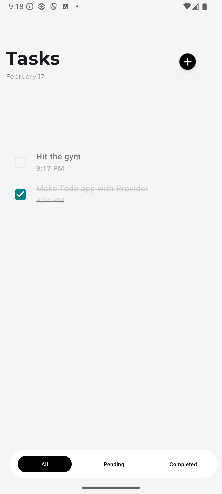
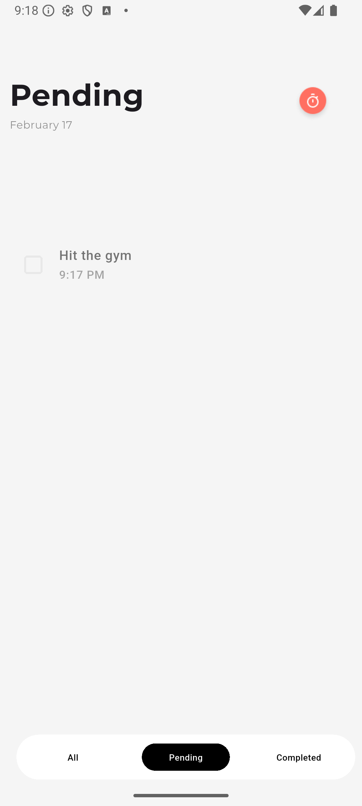
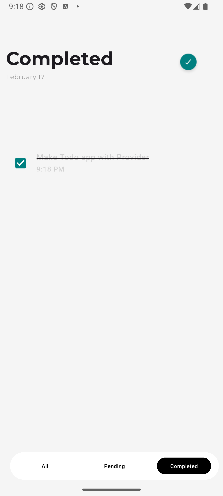
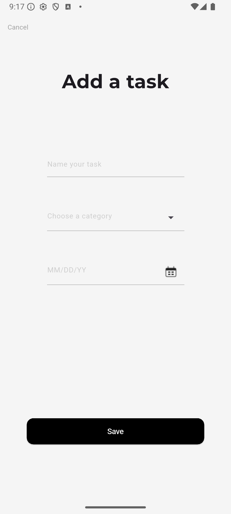
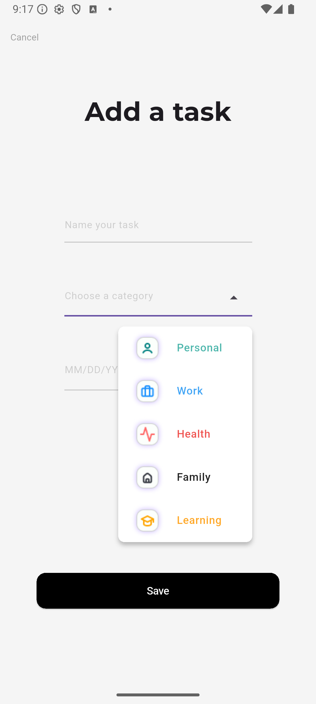

# todo_app

A new Flutter project.

## Getting Started

This project is a starting point for a Flutter application.

A few resources to get you started if this is your first Flutter project:

- [Lab: Write your first Flutter app](https://docs.flutter.dev/get-started/codelab)
- [Cookbook: Useful Flutter samples](https://docs.flutter.dev/cookbook)

For help getting started with Flutter development, view the
[online documentation](https://docs.flutter.dev/), which offers tutorials,
samples, guidance on mobile development, and a full API reference.


## 🖼 Screenshots
<p align="center">
  
  
  
  
  
</p>


---

## ⚙ Installation

1. Make sure you have [Flutter installed](https://flutter.dev/docs/get-started/install).  
2. Clone the repository:

```bash
git clone https://github.com/FAr-Es/food_delivery_app.git
