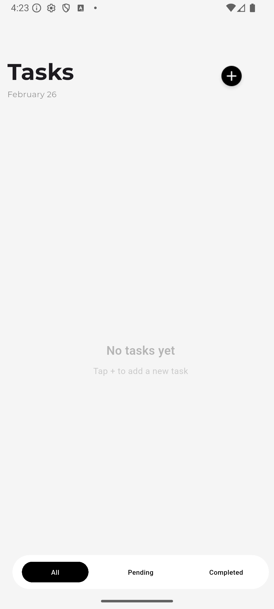
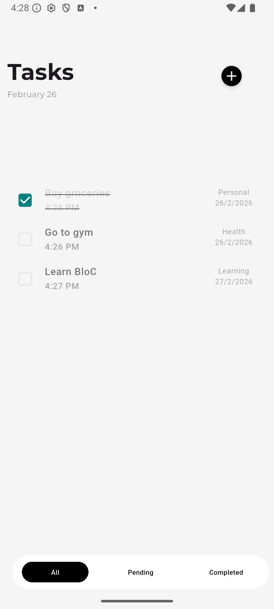

# ✅ Todo App

A clean, fully functional Flutter todo app built with the BLoC/Cubit pattern and local persistence.

---

## 📱 Screenshots

<table>
  <tr>
    <td align="center">
      <br/>
      <sub>Tasks (Empty)</sub>
    </td>
    <td align="center">
      <br/>
      <sub>Tasks</sub>
    </td>
    <td align="center">
      <br/>
      <sub>Pending</sub>
    </td>
    <td align="center">
      <br/>
      <sub>Completed</sub>
    </td>
  </tr>
</table>

<br/>

<table>
  <tr>
    <td align="center">
      <br/>
      <sub>Add Task</sub>
    </td>
    <td align="center">
      <br/>
      <sub>Category Picker</sub>
    </td>
  </tr>
</table>

## ✨ Features

- **Add tasks** with a name, category, and due date
- **Three views** — All, Pending, and Completed tasks
- **Mark complete** by tapping the checkbox
- **Swipe to delete** tasks
- **Category tagging** — Personal, Work, Health, Family, Learning
- **Persistent storage** — tasks survive app restarts via SharedPreferences

---

## 🏗️ Architecture

The app follows a clean BLoC/Cubit architecture to keep business logic separate from the UI.

```
lib/
├── blocs/
│   └── cubit/
│       ├── todo_cubit.dart      # State management logic
│       └── todo_state.dart      # State definitions
├── data/
│   └── todo_storage.dart        # SharedPreferences persistence layer
├── models/
│   └── todo_item.dart           # TodoItem data model
├── screens/
│   ├── main_screen.dart         # Root screen with IndexedStack navigation
│   ├── home_screen.dart         # All tasks view
│   ├── pending_todos.dart       # Pending tasks view
│   ├── completed_todos.dart     # Completed tasks view
│   └── add_todo.dart            # Add task screen
├── widgets/
│   └── bottom_nav_bar.dart      # Shared bottom navigation bar
└── main.dart
```

---

## 🛠️ Tech Stack

| Tool | Purpose |
|------|---------|
| [Flutter](https://flutter.dev) | UI framework |
| [flutter_bloc](https://pub.dev/packages/flutter_bloc) | State management (Cubit) |
| [shared_preferences](https://pub.dev/packages/shared_preferences) | Local persistence |
| [intl](https://pub.dev/packages/intl) | Date formatting |

---

## 🚀 Getting Started

### Prerequisites

- Flutter SDK `>=3.0.0`
- Dart `>=3.0.0`

### Installation

1. Clone the repo
   ```bash
   git clone https://github.com/FAr-Es/todo-app.git
   cd todo-app
   ```

2. Install dependencies
   ```bash
   flutter pub get
   ```

3. Run the app
   ```bash
   flutter run
   ```

---
